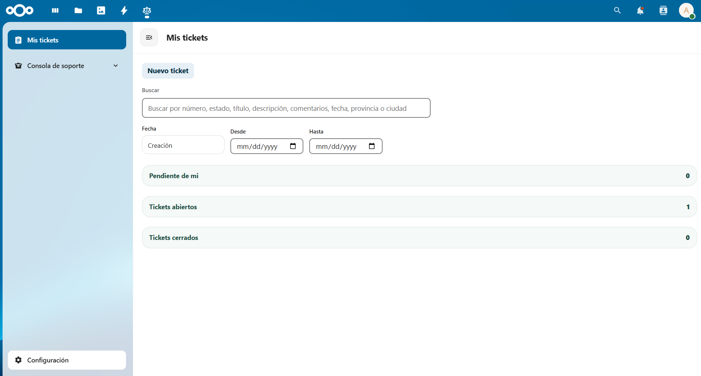

# Consultas Legales

Consultas Legales es una aplicación nativa para Nextcloud que centraliza la recepción, seguimiento y gestión interna de consultas o incidencias con un flujo claro para usuarios, equipos de soporte y administradores.

La app está pensada para organizaciones que necesitan recoger solicitudes desde Nextcloud, clasificarlas, asignarlas correctamente y mantener todo el historial en un único lugar, sin depender de servicios externos para el flujo principal. Además, puede sincronizar el seguimiento operativo con la aplicación Tasks de Nextcloud cuando esa integración está disponible y habilitada.

## Qué resuelve

- Permite que los usuarios, incluidos en alguno de los perfiles configurados, creen y gestionen consultas desde una interfaz guiada.
- Da visibilidad al estado de cada incidencia y a su historial de comentarios y adjuntos.
- Facilita el trabajo de soporte con filtros, asignación, seguimiento y exportación.
- Centraliza la configuración funcional en una consola de administración integrada en Nextcloud.
- Permite crear reglas para la asignación automática de tickets.
- Puede reflejar tickets asignados en Tasks para apoyar el seguimiento operativo del equipo.

## Instalación

La app puede instalarse desde el apartado `Apps` de Nextcloud. En el Store aparece clasificada dentro de las categorías `Organization`, `Social & communication` y `Tools`.

## Funciones principales

### Alta de incidencias

- Creación de tickets en dos pasos para guiar mejor al usuario.
- Selección jerárquica de tipo de incidencia.
- Selección de provincia para apoyar el enrutado y la asignación.
- Formulario con datos personales configurables por la organización.
- Envío inicial con descripción, archivos y enlaces.

### Área de usuario

- Vista de `Mis incidencias` con acceso rápido a la creación de un nuevo ticket.
- Consulta del estado actual y del historial visible de cada incidencia.
- Pantalla de detalle en modo solo lectura para los datos del ticket.
- Publicación de comentarios y adjuntos como parte de la conversación.
- Acción de `Repetir incidencia` para reutilizar información de un caso anterior.
- Configuración personal para precargar datos frecuentes en nuevas solicitudes.

### Consola de soporte

- Listado configurable con una vista compacta y orientada a gestión diaria.
- Filtros por estado, asignación, tipo, provincia, fechas y texto libre.
- Filtros predefinidos y filtros guardados por el equipo.
- Gestión de estado, criticidad, asignación y descripción interna de soporte.
- Comentarios internos o visibles para el usuario según el contexto.
- Edición y borrado del último comentario propio de soporte dentro del flujo de trabajo del ticket.
- Exportación CSV del conjunto visible de resultados.
- Integración opcional con Tasks para crear o actualizar tareas asociadas al ticket asignado.

### Administración

- Gestión de perfiles funcionales y acceso por usuarios o grupos de Nextcloud.
- Configuración de tipos y subtipos de incidencia.
- Catálogos iniciales para empezar a usar la app desde el primer arranque.
- Reordenado de estados para definir el orden visible en la operativa de soporte.
- Reglas de asignación automática por tipo y, opcionalmente, por provincia.
- Configuración de extensiones y límites para adjuntos.
- Preferencias de notificaciones.
- Edición y borrado de comentarios visibles, y borrado completo de tickets con confirmación para los perfiles administrativos.

## Roles de la aplicación

La aplicación organiza la experiencia en tres perfiles funcionales:

- `Usuario`: crea incidencias, consulta su seguimiento y responde cuando se solicita más información.
- `Soporte`: trabaja las incidencias visibles, aplica filtros, comenta, asigna y actualiza el estado.
- `Administrador`: configura catálogos, perfiles, reglas, notificaciones e integraciones.

El acceso no se concede por el simple hecho de tener una cuenta en Nextcloud. La app solo se muestra a usuarios que tengan al menos un perfil efectivo.

Ese perfil efectivo se calcula a partir de la configuración de `Perfiles`, donde cada perfil puede asignarse directamente a usuarios concretos o a grupos reales de Nextcloud. Un mismo usuario puede tener más de un perfil si coincide con varias asignaciones.

Si un usuario no tiene ningún perfil efectivo, la aplicación no carga su navegación funcional y redirige fuera de la SPA principal.

En una instalación inicial, la app puede sembrar asignaciones base para grupos de referencia como `userLegal`, `supportLegal` y `admin`. A partir de ahí, la configuración guardada en `Perfiles` es la que determina el acceso real.

## Integración con Nextcloud

- Usa usuarios y grupos reales de Nextcloud para permisos y asignación.
- Guarda archivos adjuntos en la infraestructura de archivos de Nextcloud.
- Se integra con notificaciones nativas de Nextcloud y con correo según configuración.
- Puede integrarse con Tasks para sincronizar tareas operativas vinculadas a tickets asignados.

## Pensada para un uso real desde el primer día

Consultas Legales incluye una base funcional orientada a trabajar desde el primer arranque:

- tipos de consulta iniciales;
- criticidades base;
- flujo de estados inicial;
- soporte para catálogos y configuración progresiva;
- separación clara entre experiencia de usuario, soporte y administración.

## Compatibilidad

- Nextcloud 30 a 33
- PHP 8.1 o superior

## Nota para desarrollo

Este repositorio incluye el código fuente completo de la app. Para desarrollo local y pruebas manuales existe un entorno limpio en `dev/clean-nextcloud/`. Si necesitas compilar el frontend o ejecutar tests, consulta los scripts definidos en `package.json` y `composer.json`.

## Licencia

`AGPL-3.0-or-later`